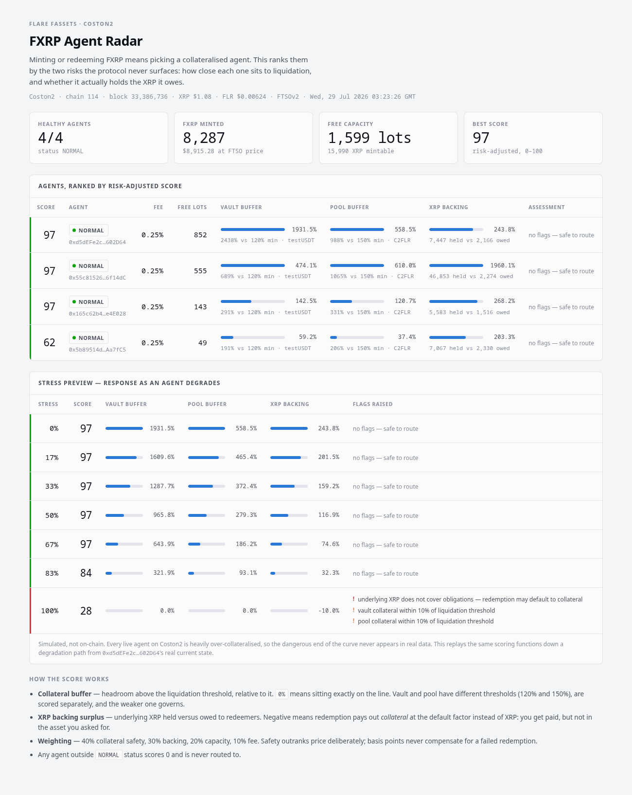

# FXRP Agent Radar

Risk-scored agent selection for Flare FAssets. Reads live chain state on Coston2 and
tells you **which agent is actually safe to mint or redeem FXRP through** — and why.



## The problem

To mint or redeem FXRP you must pick an **agent**. The AssetManager exposes 40 raw
fields per agent and no judgement. Two risks matter to a user and neither is visible:

**1. Liquidation proximity.** An agent sitting just above its minimum collateral ratio
can drop into CCB or liquidation. Raw collateral ratios don't tell you this — 280% sounds
healthy, but the vault threshold is 120% and the pool threshold is 150%, so the same
number means very different things depending on which collateral you're looking at.

**2. Redemption default.** If an agent's underlying XRP balance doesn't cover what it
owes redeemers, redemption pays out **collateral** at
`redemptionDefaultFactorVaultCollateralBIPS` (currently 105%) instead of actual XRP.
You get paid — but not in the asset you asked for. Anyone redeeming *because they want
XRP* cares about this a great deal, and nothing in the protocol surfaces it before you commit.

## What this does

- Reads every agent from `AssetManagerFXRP` and resolves each one's real liquidation
  thresholds from `getCollateralTypes()` — vault and pool are scored separately, and
  the weaker of the two governs.
- Computes **collateral buffer** (headroom above the liquidation line, relative to the
  line) and **XRP backing surplus** (held vs owed underlying).
- Prices exposure in USD from **FTSOv2**, Flare's enshrined oracle.
- Produces a 0–100 risk-adjusted score, ranks agents, and raises explicit flags.
- Routes a requested lot size to the best agent that can actually serve it.

Weighting is 40% collateral safety, 30% backing, 20% capacity, 10% fee. Safety outranks
price on purpose: a few basis points of fee never compensates for a failed redemption.
Any agent not in `NORMAL` status scores 0 and is never routed to.

## Flare integration

| Protocol | Use |
|---|---|
| **FAssets** (`AssetManagerFXRP`) | agent enumeration, `getAgentInfo`, `getCollateralTypes`, settings |
| **FTSOv2** | live FLR/USD and XRP/USD feeds to size exposure in dollars |
| **FlareContractRegistry** | on-chain address resolution — no hardcoded deployment addresses |

Everything reads from chain at runtime. Contract addresses are resolved through the
registry, so the tool follows Flare deployments rather than pinning them.

## Run it

```bash
npm install
npm test              # scoring-logic checks, no network
npm start             # ranked agent table from live Coston2
npm start -- --lots 5 # also pick the best agent for 5 lots (50 XRP)
npm start -- --json   # machine-readable

npm run snapshot      # write web/data.json from chain
npm run web           # serve the dashboard at :8899
npm run standalone    # web/standalone.html — single file, opens offline
```

Example:

```
score     status    fee   lots  vaultCR  buffer   poolCR  buffer  XRP backing agent
   97     NORMAL   0.3%    852  2434.6% 1928.8%   988.4%  558.9%       243.8% 0xd5dEFe2c…
   62     NORMAL   0.3%     49   190.8%   59.0%   206.2%   37.5%       203.3% 0x5b89514d…
```

## Stress preview

Every live agent on Coston2 is heavily over-collateralised, so the risk logic never
fires against real data — which makes it impossible to review. `stressPath()` replays
the *same* scoring functions down a degradation path from an agent's real current
state, so the behaviour at the dangerous end is visible and testable. It is clearly
labelled as simulated in the UI and writes nothing on chain.

At full stress the top agent falls from **97 to 28** and raises three flags, including
the redemption-default warning.

## Layout

```
src/radar.mjs     scoring engine — pure functions + chain reads
bin/radar.mjs     CLI
bin/snapshot.mjs  writes web/data.json
web/index.html    dashboard (light + dark, no build step)
test/radar.test.mjs
```

The scoring functions are pure and separately tested: buffer and surplus maths,
safety-over-price ordering, disqualification of non-normal agents, warning thresholds,
and monotonicity of the stress path.

## Limitations

- Scores tie when agents are genuinely all safe. That is deliberate — the model does not
  manufacture precision that isn't in the data. Ties break on fee, then capacity.
- The dashboard reads a generated snapshot rather than holding a live socket; re-run
  `npm run snapshot` to refresh.
- Minting requires an XRPL-side payment and FDC proof, which is out of scope here — this
  tool covers agent selection and risk, which is the part users currently have no help with.
